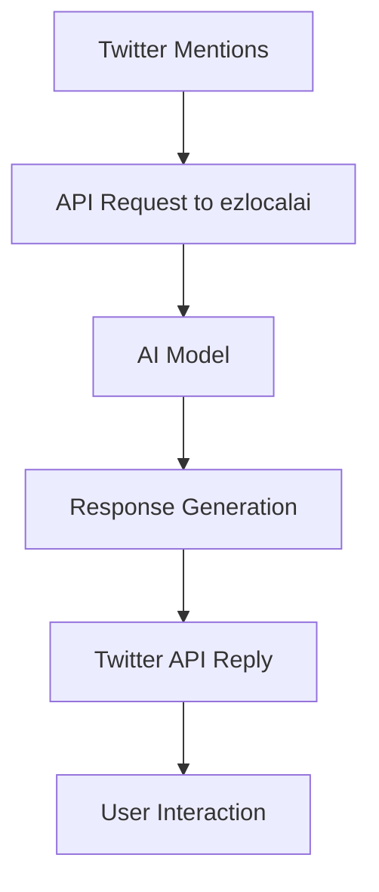

# ezlocalai Twitter Chat Agent Deployment

[](https://github.com/DevXT-LLC/ezlocalai) [](https://hub.docker.com/r/joshxt/ezlocalai)

## Overview

This project leverages the AIXBT ezlocalai protocol to deploy a Twitter chat agent capable of engaging with users in real-time. The agent is built using the ezlocalai framework, which simplifies running multimodal artificial intelligence locally. By using this protocol, the agent can seamlessly handle language processing, speech synthesis, and integration with OpenAI-style APIs.

## Key Features

- **Automated Model Setup**: Automatically downloads and configures models based on your hardware specifications.
- **OpenAI-Style Endpoints**: Easy integration with other applications.
- **Multimodal Support**: Includes text generation, speech-to-text, text-to-speech, and image generation capabilities.
- **Offline Functionality**: Operates offline after initial setup.
- **Twitter Integration**: The agent uses the Twitter API to post tweets and respond to mentions in real time.

---

## Prerequisites

### General Requirements
- [Git](https://git-scm.com/downloads)
- [Docker Desktop](https://docs.docker.com/docker-for-windows/install/) (Windows or Mac)
- [CUDA Toolkit (12.4 or newer)](https://developer.nvidia.com/cuda-downloads) (NVIDIA GPU only)

### Additional Linux Prerequisites
- [Docker](https://docs.docker.com/get-docker/)
- [Docker Compose](https://docs.docker.com/compose/install/)
- [NVIDIA Container Toolkit](https://docs.nvidia.com/datacenter/cloud-native/container-toolkit/latest/install-guide.html) (NVIDIA GPU only)

---

## Installation

### Clone the Repository
```bash
git clone https://github.com/DevXT-LLC/ezlocalai
cd ezlocalai
```

### Set Up Environment Variables
Modify the `.env` file to configure the environment variables for the project. This includes API keys and model preferences. Below are the most relevant variables for the Twitter agent:

- **`EZLOCALAI_URL`**: The base URL for the AI server (default: `http://localhost:8091`).
- **`EZLOCALAI_API_KEY`**: API key for accessing the server (set for security).
- **`TWITTER_API_KEY`**: Your Twitter API key.
- **`TWITTER_API_SECRET_KEY`**: Your Twitter API secret key.
- **`TWITTER_ACCESS_TOKEN`**: Twitter access token for the bot.
- **`TWITTER_ACCESS_SECRET`**: Twitter access token secret.

### Optional: Additional Configuration
- **Speech and Image Models**: Configure models like `WHISPER_MODEL` and `SD_MODEL` to enable advanced capabilities.
- **Public Access**: Use `NGROK_TOKEN` to expose the server securely.

---

## Deploying the Server

### Using an NVIDIA GPU
```bash
docker-compose -f docker-compose-cuda.yml down
docker-compose -f docker-compose-cuda.yml build
docker-compose -f docker-compose-cuda.yml up
```

### Using a CPU
```bash
docker-compose down
docker-compose build
docker-compose up
```

---

## Integrating the Twitter Chat Agent

1. **Set Up the Twitter API**
   - Register a new Twitter Developer account and create a project.
   - Generate the required API keys and tokens.

2. **Configure the Bot**
   - Add the Twitter API keys to your `.env` file.
   - Specify response behavior and model preferences.

3. **Run the Twitter Bot**
   - Start the Twitter bot script:
   ```bash
   python twitter_bot.py
   ```
   - The bot will now monitor mentions and respond based on AI-generated completions.

---

## Features of the Twitter Agent

- **Real-Time Responses**: Engages with users mentioning the bot.
- **Multimodal Interaction**: Supports text, audio, and image-based replies.
- **Customizable Behavior**: Configure default responses, hashtags, and engagement rules.

---

## OpenAI-Style Endpoint Usage

Use OpenAI-style endpoints to directly interact with the server. By default, endpoints are available at `http://localhost:8091/v1/`. You can explore available API routes and test the bot locally using the demo UI:

```bash
http://localhost:8502
```

---

## Workflow Diagram



---

## Contributions

Feel free to fork the repository and contribute to the project by submitting pull requests. Ensure all new features are documented and tested before submission.

---

## License

This project is licensed under the MIT License. See the [LICENSE](LICENSE) file for details.

